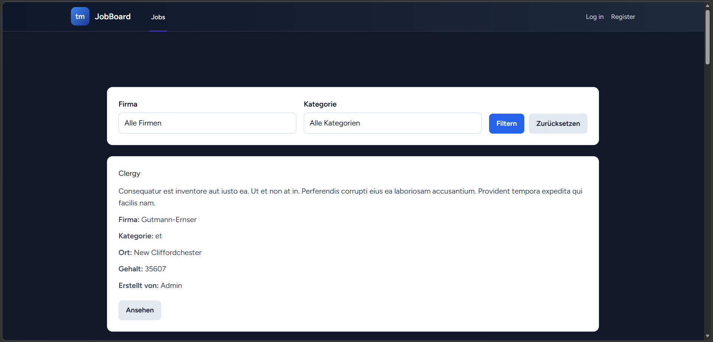
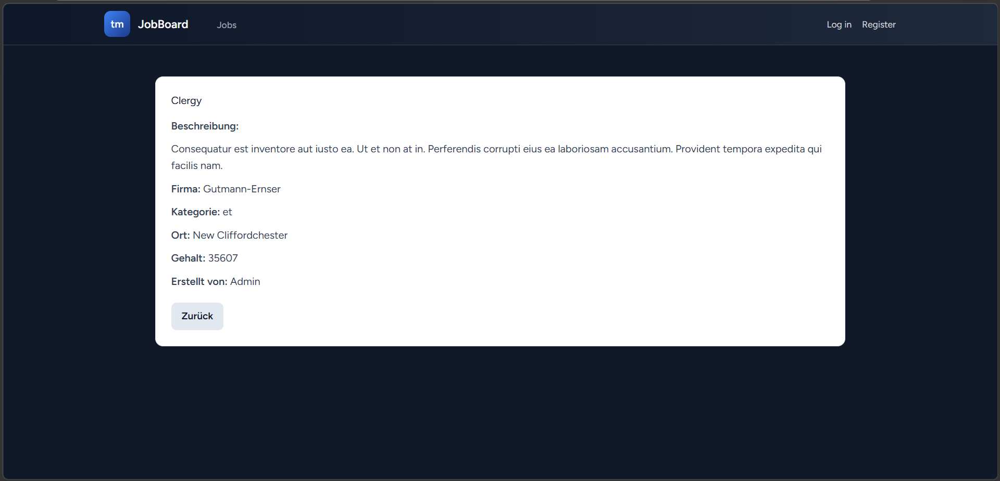
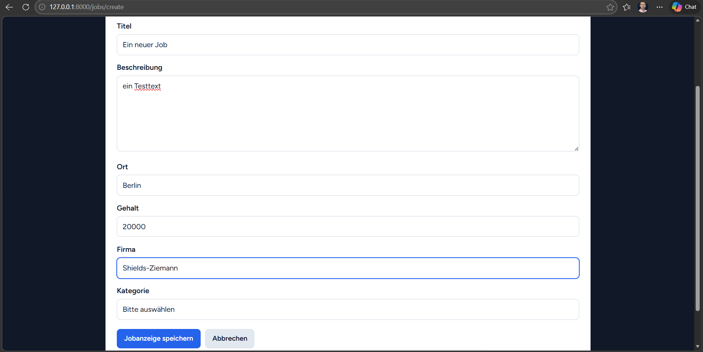
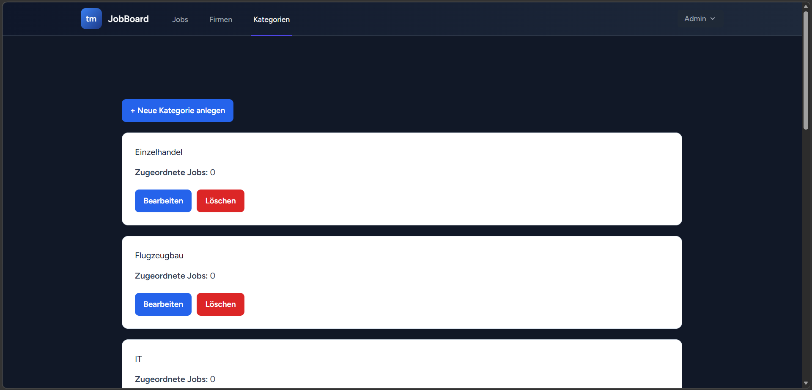
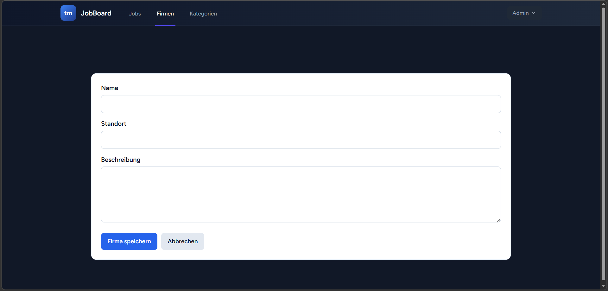
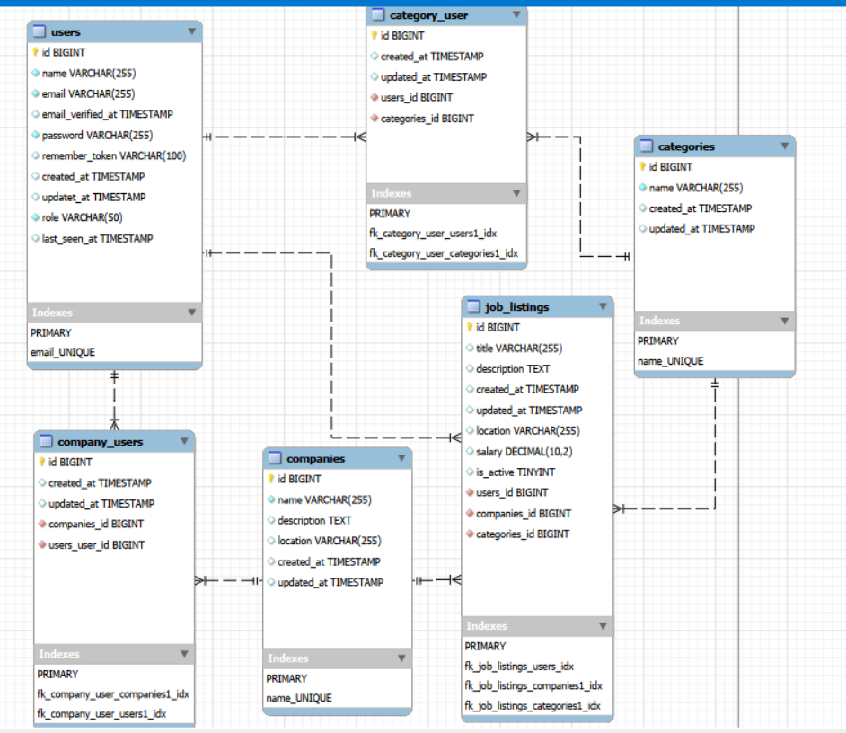

# JobBoard (Laravel Projekt)


---

## Deutsch

### Beschreibung

Diese Anwendung ist eine webbasierte Jobbörse zur Verwaltung und Darstellung von Stellenanzeigen.

Die Plattform kann öffentlich ohne Login genutzt werden und bietet zusätzlich ein rollenbasiertes Zugriffssystem für interne Benutzer.

Ziel des Projekts war die Entwicklung einer strukturierten und erweiterbaren Laravel-Anwendung.

---

### Funktionen

* Rollenbasiertes Zugriffssystem (Guest, Visitor, User, Admin)
* CRUD-Funktionalität für Jobanzeigen
* Verwaltung von Firmen und Kategorien durch Admins
* Filter nach Firma und Kategorie
* Pagination mit Zustandserhalt
* „Meine Jobs“-Bereich für eingeloggte Benutzer
* Caching zur Reduzierung von Datenbankabfragen
* Automatisierte Tests mit CI (GitHub Actions)
* Personalisierter Dashboard-Bereich für Visitor
* Speichern von Firmen und Kategorien
* Anzeige neuer passender Jobs basierend auf Interessen
* Zeitbasierte Erkennung neuer Inhalte (last_seen_at)

---

### Rollen

**Gast (nicht eingeloggt)**

* Anzeigen von Jobanzeigen
* Nutzung von Filtern

**Visitor (eingeloggt)**

* gleiche Basisrechte wie Gast
* zusätzlich:
    * persönliches Dashboard
    * Speichern von Firmen und Kategorien
    * Anzeige neuer passender Jobs

**User**

* Jobs erstellen
* Jobs bearbeiten und löschen (rollenbasiert, auch teamorientiert möglich)

**Admin**

* vollständige Kontrolle über alle Daten
* Verwaltung von Firmen und Kategorien

---

### Funktionen im Detail

**Jobanzeigen**

* Übersicht aller Jobs
* Detailansicht
* Erstellung, Bearbeitung und Löschung (rollenabhängig)

**Filter**

* Filter nach Firma
* Filter nach Kategorie
* kombinierbar
* Zustand bleibt bei Pagination erhalten

**Benutzerfreundlichkeit**

* Pagination bei großen Datenmengen
* Rücksprung zur vorherigen Seite nach Aktionen
* Scroll-Position bleibt erhalten

**Performance**

* Caching der Jobliste


**Personalisierung (Visitor)**

* Speichern von Firmen und Kategorien
* Übersicht im Dashboard
* Anzeige neuer passender Jobs
* manuelle Aktualisierung möglich
* bewusste Markierung als „gesehen“

Diese Funktion ermöglicht eine einfache, aber effektive Personalisierung der Anwendung.

---

### Screenshots

#### Job Übersicht mit Filter


#### Job Detailansicht


#### Job erstellen


#### Kategorienverwaltung (Admin)


#### Firmenverwaltung (Admin)


---

### Technologien

* PHP 8
* Laravel
* Blade Templates
* MySQL / MariaDB
* HTML / CSS
* GitHub Actions (CI)
* SQLite (lokal für Entwicklung und Tests)

---

### Datenbank

Relationale Datenbank mit folgenden Tabellen:

* Users
* Jobs
* Companies
* Categories

Eigenschaften:

* Beziehungen zwischen Jobs, Firmen und Kategorien
* Firmen und Kategorien können nur gelöscht werden, wenn keine abhängigen Jobs existieren
* Umsetzung über Laravel Migrationen

Zusätzlich:

* Pivot-Tabellen für gespeicherte Firmen und Kategorien
* Zeitstempel `last_seen_at` für personalisierte Inhalte

Beziehungen:

* User ↔ Companies (gespeichert)
* User ↔ Categories (gespeichert)

---

## Datenbankmodell (aktueller Stand)

Das ursprüngliche Datenmodell wurde im Verlauf der Entwicklung erweitert.

Neu hinzugekommen:
- Pivot-Tabellen für gespeicherte Firmen und Kategorien (`company_user`, `category_user`)
- `last_seen_at` im User zur Ermittlung neuer Jobs seit dem letzten Besuch


Das ursprüngliche Datenmodell wurde im Verlauf der Entwicklung erweitert.

Neu hinzugekommen:
- Pivot-Tabellen für gespeicherte Firmen und Kategorien (`company_user`, `category_user`)
- `last_seen_at` im User zur Ermittlung neuer Jobs seit dem letzten Besuch



---

### Installation

```bash
git clone https://github.com/AndrePflegel/job-app.git
cd job-app

composer install
cp .env.example .env
php artisan key:generate

php artisan migrate
php artisan db:seed

php artisan serve
```

---

### Tests

* Laravel Feature Tests
* GitHub Actions Pipeline
* Tests laufen auf PHP 8.2, 8.3 und 8.4

Abgedeckte Bereiche:

* Zugriffskontrolle (Guest / Visitor / User / Admin)
* Job-Erstellung und Bearbeitung
* gespeicherte Firmen und Kategorien
* personalisierte Job-Vorschläge
* Zustandsänderungen (z. B. „als gesehen markieren“)

---

### Sicherheit

* Passwort-Hashing
* Rollenbasierte Zugriffskontrolle
* Schutz sensibler Dateien (.env, storage, vendor)

---

### Test-Accounts

| Rolle   | E-Mail                                    | Passwort |
| ------- | ----------------------------------------- | -------- |
| Admin   | [admin@test.de](mailto:admin@test.de)     | password |
| User    | [user@test.de](mailto:user@test.de)       | password |
| Visitor | [visitor@test.de](mailto:visitor@test.de) | password |

---

### Erweiterungsmöglichkeiten

* Favoritenfunktion
* Erweiterte Suche
* API-Anbindung
* E-Mail-Benachrichtigungen
* UI-Verbesserungen
* gespeicherte Jobs (Favoriten)
* Benachrichtigungen bei neuen passenden Jobs
* individuelle Suchprofile
* Echtzeit-Updates

---

## English

### Description

This project is a web-based job board application built with Laravel.

It supports public access without login as well as role-based internal management.

---

### Features

* Role-based access control
* CRUD operations for job listings
* Admin management for companies and categories
* Filtering system
* Pagination with state persistence
* CI pipeline with automated tests

---

### Tech Stack

* PHP / Laravel
* Blade Templates
* MySQL / MariaDB
* GitHub Actions

---

### Setup

```bash
composer install
cp .env.example .env
php artisan key:generate
php artisan migrate
php artisan db:seed
php artisan serve
```

---

### Author

Andre Pflegel
